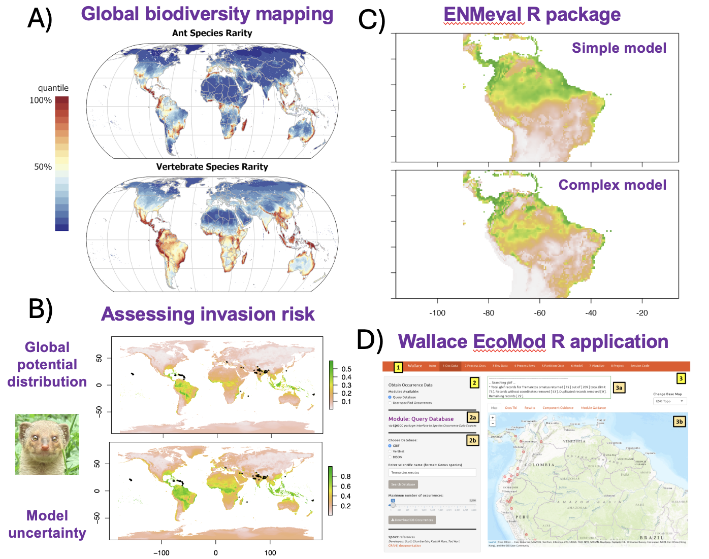

# Projects

## Advancements for species distribution modeling

Species distribution models (SDMs) make estimates of habitat suitability, range limits, and niche relationships with environmental variables. For example, we use SDMs to map biodiversity patterns at large geographic scales (A: [Kass et al. 2022](https://doi.org/10.1126/sciadv.abp9908)); employ SDMs for various applications including climate change impacts, conservation, and invasion risk (B: image from Kass et al. *in review*); and work with collaborators to develop open-source tools for community use such as the R package [ENMeval](https://doi.org/10.1111/2041-210X.13628) (C), which enables automated tuning of complexity for SDMs, and the R application [Wallace EcoMod](https://doi.org/10.1111/ecog.06547) (D), which allows users to complete a reproducible SDM workflow using an interactive graphic-user interface. 



## Mapping ecosystem service potential with biodiversity models

Future climate change will alter current biodiversity patterns and affect the providers of crucial ecosystem functions and services, such as pollination and food provision. To maintain them, we need accurate predictions of how the diversity of providers may shift in the future, including individual species' ranges and composite metrics such as richness and turnover of taxonomic, phylogenetic, and functional diversity. Given the connections between biodiversity and ecosystem function, we can link these predictions to the potential for provision of crucial ecosystem services. However, future predictions of biodiversity are associated with many sources of uncertainty, and identifying which regions have predictions with high confidence is crucial for environmental planning. Dr. Kass is managing PI of a **JSPS KAKENHI Grant-in-aid for Scientific Research** (Kiban C) that aims to both quantify and map aspects of future prediction uncertainty for important providers of ecosystem functions and services: bees, butterflies, and edible wild plants. This grant is managed by Prof. Kass and includes collaborators from Tohoku University and the National Institute of Environmental Studies (NIES).



## Estimating patterns of marine biodiversity using eDNA

Marine biodiversity is heavily studied but still relatively unknown. One main reason is that many organisms are very difficult to detect due to cryptic habitat preferences or behavior, occupancy of deep ocean strata, or simply because they are rare within their ranges. All organisms shed DNA strands into the environment, called eDNA, and these can be sampled to significantly broaden the scope and accuracy of detections, potentially leading to the discovery of new species. Species distribution models and other biodiversity models constructed with eDNA, along with other sources such as occurrence data from museums and citizen science, have the great potential to elucidate unknown centers of marine diversity. The Macroecology Lab is collaborating with the [Ecological Integration Lab](https://www.lifesci.tohoku.ac.jp/en/research/fields/laboratory.html?id=2553) led by Prof. Michio Kondoh on two projects that center on these themes. [WPI-AIMEC](https://wpi-aimec.jp/en/) is an interdisciplinary research institution established jointly this year at Tohoku University and [JAMSTEC](https://www.jamstec.go.jp/e/) to research how marine ecosystems respond to environmental changes combining ocean physics, ecology, and data science. Ocean Shot is a grant sponsored by the [Sasakawa Peace Foundation](https://www.spf.org/en/) to build a comprehensive reference database for understudied marine organisms that will help us match eDNA samples to species.



## Automated wildlife monitoring using cameras, sound recorders, and local climate measurements

Expanding networks to monitor biodiversity is vital to fill sampling gaps and investigate how ecological communities shift over gradients of environmental change and over time. We are constructing stations in pilot areas around Japan (currently Miyagi prefecture) that feature automated infrared cameras, sound recorders, and devices to measure local climate conditions (i.e., below-canopy temperature). We will use these data to develop models to predict species' occupancy and detection probabilities over environmental gradients, as well as monitor how communities change over time with disturbances. To do this, we are connecting with local partners in the private sector through the COI-NEXT project Nature-Positive Sustainable Development Hub, funded by [JST](https://www.jst.go.jp/EN/) and managed by Prof. Michio Kondoh. We are contributors to the [Snapshot Japan](https://www.nies.go.jp/biology/snapshot_japan/en/index.html) project, which aims to assess the status of wildlife in Japan on a yearly basis by combining camera trap data from across the country.

<!--  -->
